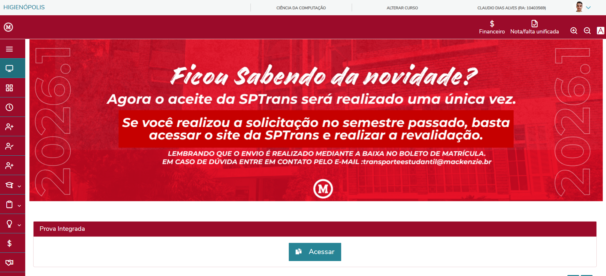

# Projeto de Web Mobile
### Participantes: 
- Cláudio Dias - 10403569
- Guillermo Kuznietz - 10410134
- Matheus Mustaro - 10409259

## Explicação do processo de ideação
Buscamos montar um chatbot, utilizando técnica de RAG, para alunos tirarem eventuais dúvidas sobre a instituição do Mackenzie. Será utilizado a trindade HTML, CSS e Javascript, assim como python para a montagem do backend e sua API. 

## Caráter extensionista
Para alunos do mackenzie.

## Imagens do wireframe

### Protótipo para modelo web


<hr>


---
### Protótipo para modelo mobile


---

## Modelo do HTML
```

<input type="button" value="MACK AI">
```
O `img` é utilizado para definir o background e o `input` para interagir com o chatbot.


```
<main>
<header>MACK AI</header>
<section>
    <div id="user">
        <p>Lorem ipsum dolor sit amet consectetur adipisicing elit. Omnis quos excepturi rerum dolores explicabo
            id deleniti atque natus molestias possimus?</p>
    </div>
    <div id="bot">
        
        <p>Lorem ipsum dolor sit amet consectetur adipisicing elit. Omnis quos excepturi rerum dolores explicabo
            id deleniti atque natus molestias possimus?</p>
    </div>
</section>
```
Teremos uma estrutura básica de interface de chat chamada *MACK AI*, utilizamos a tag `<main>` como contêiner principal. Ele organiza o conteúdo em um cabeçalho e uma seção, que separa a mensagem do usuário *#user* da mensagem do bot *#bot* através de elementos `<div>` e `<p>`. O bot inclui um espaço reservado para imagem.

```
    <footer>
        <textarea name="prompt" id="prompt">Pergunte alguma coisa</textarea>
    </footer>
</main>
```
<p>No rodapé teremos o campo de texto para envio das mensagens.</p>

